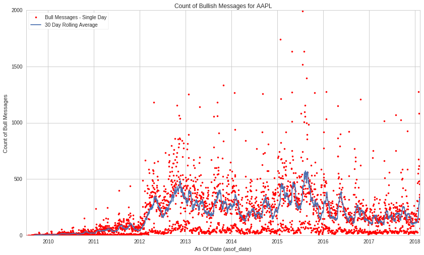
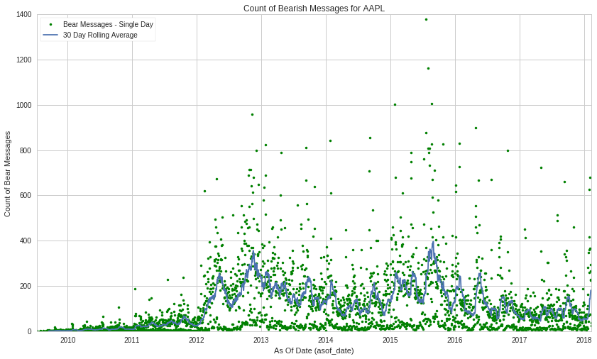
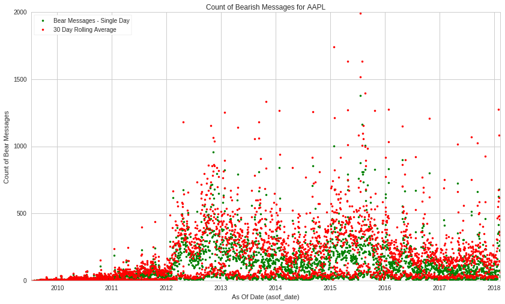
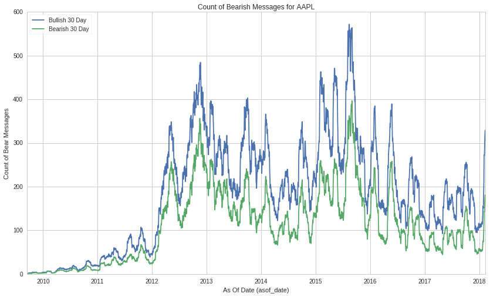
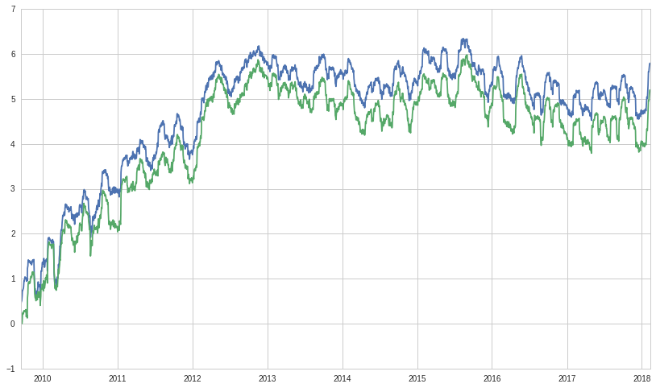
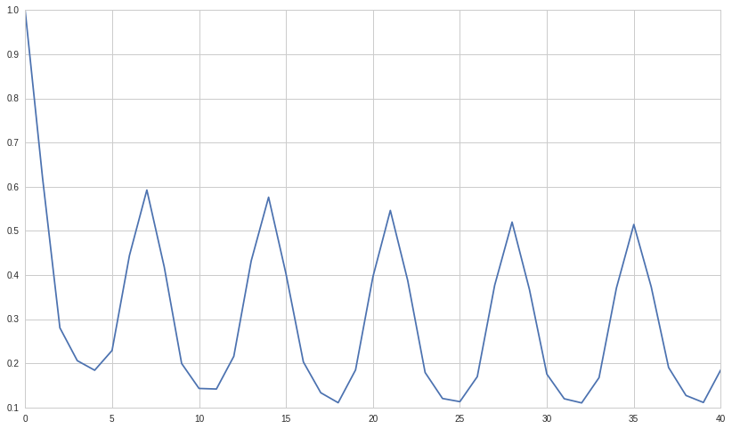
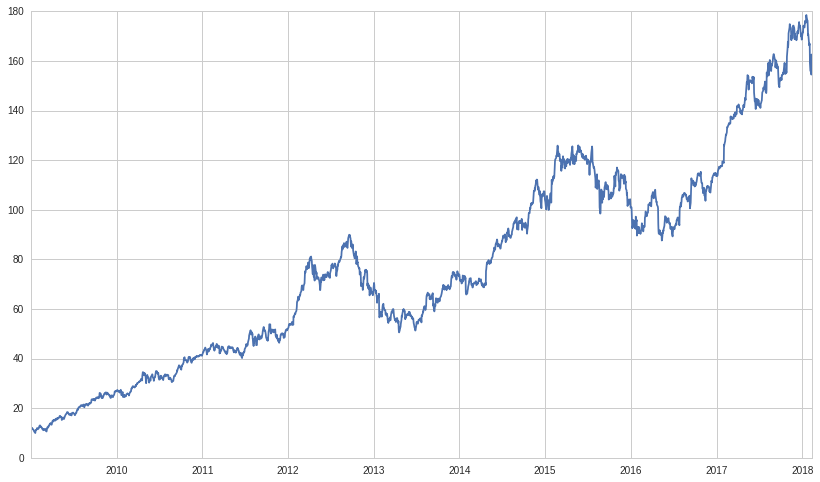
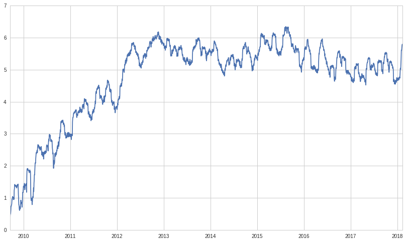
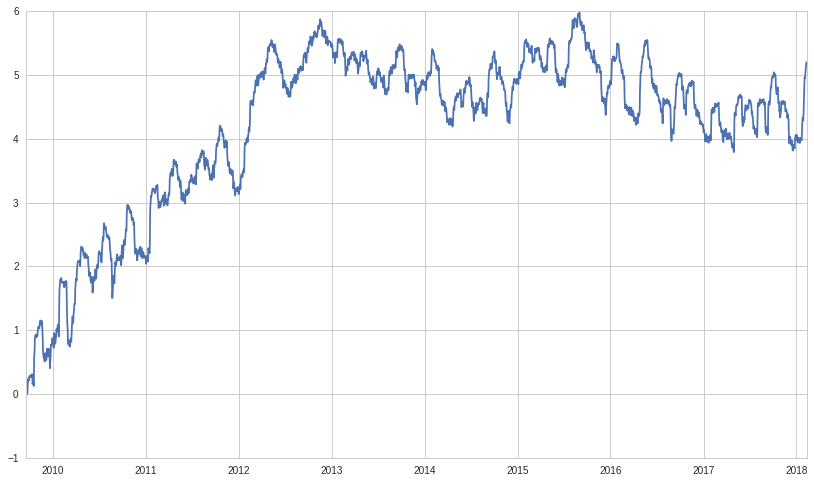
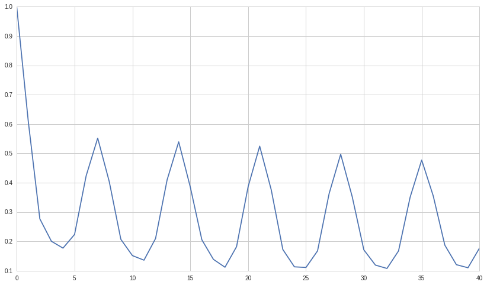

```python
# import the free sample of the dataset
from quantopian.interactive.data.psychsignal import stocktwits_free  as dataset

# or if you want to import the full dataset, use:
# from quantopian.interactive.data.psychsignal import stocktwits

# import data operations
from odo import odo
# import other libraries we will use
import pandas as pd
import matplotlib.pyplot as plt
```


```python
# Filtering for AAPL
aapl = dataset[dataset.sid == 24]
aapl_df = odo(aapl.sort('asof_date'), pd.DataFrame)
plt.plot(aapl_df.asof_date, aapl_df.bull_scored_messages, marker='.', linestyle='None', color='r')
plt.plot(aapl_df.asof_date, pd.rolling_mean(aapl_df.bull_scored_messages, 30))
plt.xlabel("As Of Date (asof_date)")
plt.ylabel("Count of Bull Messages")
plt.title("Count of Bullish Messages for AAPL")
plt.legend(["Bull Messages - Single Day", "30 Day Rolling Average"], loc=2)
```

    /usr/local/lib/python2.7/dist-packages/ipykernel_launcher.py:5: FutureWarning: pd.rolling_mean is deprecated for Series and will be removed in a future version, replace with 
    	Series.rolling(window=30,center=False).mean()
      """


    <matplotlib.legend.Legend at 0x7f06bcd4aad0>





```python
# Filtering for AAPL
aapl = dataset[dataset.sid == 24]
aapl_df = odo(aapl.sort('asof_date'), pd.DataFrame)
plt.plot(aapl_df.asof_date, aapl_df.bear_scored_messages, marker='.', linestyle='None', color='g')
plt.plot(aapl_df.asof_date, pd.rolling_mean(aapl_df.bear_scored_messages, 30))
plt.xlabel("As Of Date (asof_date)")
plt.ylabel("Count of Bear Messages")
plt.title("Count of Bearish Messages for AAPL")
plt.legend(["Bear Messages - Single Day", "30 Day Rolling Average"], loc=2)
```

    /usr/local/lib/python2.7/dist-packages/ipykernel_launcher.py:5: FutureWarning: pd.rolling_mean is deprecated for Series and will be removed in a future version, replace with 
    	Series.rolling(window=30,center=False).mean()
      """


    <matplotlib.legend.Legend at 0x7f06a25f19d0>





```python
# Filtering for AAPL
aapl = dataset[dataset.sid == 24]
aapl_df = odo(aapl.sort('asof_date'), pd.DataFrame)
plt.plot(aapl_df.asof_date, aapl_df.bear_scored_messages, marker='.', linestyle='None', color='g')
plt.plot(aapl_df.asof_date, aapl_df.bull_scored_messages, marker='.', linestyle='None', color='r')

plt.xlabel("As Of Date (asof_date)")
plt.ylabel("Count of Bear Messages")
plt.title("Count of Bearish Messages for AAPL")
plt.legend(["Bear Messages - Single Day", "30 Day Rolling Average"], loc=2)
```


    <matplotlib.legend.Legend at 0x7f06a2686cd0>





```python
aapl = dataset[dataset.sid == 24]
aapl_df = odo(aapl.sort('asof_date'), pd.DataFrame)
plt.plot(aapl_df.asof_date, pd.rolling_mean(aapl_df.bull_scored_messages, 30))
plt.plot(aapl_df.asof_date, pd.rolling_mean(aapl_df.bear_scored_messages, 30))

plt.xlabel("As Of Date (asof_date)")
plt.ylabel("Count of Bear Messages")
plt.title("Count of Bearish Messages for AAPL")
plt.legend(["Bullish 30 Day", "Bearish 30 Day"], loc=2)
```

    /usr/local/lib/python2.7/dist-packages/ipykernel_launcher.py:3: FutureWarning: pd.rolling_mean is deprecated for Series and will be removed in a future version, replace with 
    	Series.rolling(window=30,center=False).mean()
      This is separate from the ipykernel package so we can avoid doing imports until
    /usr/local/lib/python2.7/dist-packages/ipykernel_launcher.py:4: FutureWarning: pd.rolling_mean is deprecated for Series and will be removed in a future version, replace with 
    	Series.rolling(window=30,center=False).mean()
      after removing the cwd from sys.path.


    <matplotlib.legend.Legend at 0x7f06a224d410>





```python
plt.plot(aapl_df.asof_date, np.log(pd.rolling_mean(aapl_df.bull_scored_messages, 30)))
plt.plot(aapl_df.asof_date, np.log(pd.rolling_mean(aapl_df.bear_scored_messages, 30)))

```

    /usr/local/lib/python2.7/dist-packages/ipykernel_launcher.py:1: FutureWarning: pd.rolling_mean is deprecated for Series and will be removed in a future version, replace with 
    	Series.rolling(window=30,center=False).mean()
      """Entry point for launching an IPython kernel.
    /usr/local/lib/python2.7/dist-packages/ipykernel_launcher.py:2: FutureWarning: pd.rolling_mean is deprecated for Series and will be removed in a future version, replace with 
    	Series.rolling(window=30,center=False).mean()
      


    [<matplotlib.lines.Line2D at 0x7f068d354cd0>]





```python
import numpy as np
from statsmodels.tsa.stattools import acf, pacf

x=acf(pd.rolling_mean(aapl_df.bull_scored_messages, 1)[30:])
plt.plot(x)
```

    /usr/local/lib/python2.7/dist-packages/ipykernel_launcher.py:4: FutureWarning: pd.rolling_mean is deprecated for Series and will be removed in a future version, replace with 
    	Series.rolling(window=1,center=False).mean()
      after removing the cwd from sys.path.


    [<matplotlib.lines.Line2D at 0x7f06a069e150>]





```python
data = get_pricing('AAPL', start_date='2009-1-1', end_date='2018-6-1')
plt.plot(data['price'])
```


    [<matplotlib.lines.Line2D at 0x7f06a052b490>]





```python
plt.plot(aapl_df.asof_date, np.log(pd.rolling_mean(aapl_df.bull_scored_messages, 30)))

```

    /usr/local/lib/python2.7/dist-packages/ipykernel_launcher.py:1: FutureWarning: pd.rolling_mean is deprecated for Series and will be removed in a future version, replace with 
    	Series.rolling(window=30,center=False).mean()
      """Entry point for launching an IPython kernel.


    [<matplotlib.lines.Line2D at 0x7f0698f46a50>]





```python
plt.plot(aapl_df.asof_date, np.log(pd.rolling_mean(aapl_df.bear_scored_messages, 30)))


```

    /usr/local/lib/python2.7/dist-packages/ipykernel_launcher.py:1: FutureWarning: pd.rolling_mean is deprecated for Series and will be removed in a future version, replace with 
    	Series.rolling(window=30,center=False).mean()
      """Entry point for launching an IPython kernel.


    [<matplotlib.lines.Line2D at 0x7f068bfc1e90>]





```python
plt.plot(data['price'])
```


    [<matplotlib.lines.Line2D at 0x7f068befdfd0>]


```python
import numpy as np
from statsmodels.tsa.stattools import acf, pacf

x=acf(pd.rolling_mean(aapl_df.bear_scored_messages, 1)[30:])
plt.plot(x)
```

    /usr/local/lib/python2.7/dist-packages/ipykernel_launcher.py:4: FutureWarning: pd.rolling_mean is deprecated for Series and will be removed in a future version, replace with 
    	Series.rolling(window=1,center=False).mean()
      after removing the cwd from sys.path.


    [<matplotlib.lines.Line2D at 0x7f068be04f10>]




